# gnmic → OTLP → OTel Collector → Prom remote_write lab

Quick-and-dirty containerlab demonstrating a simnple network telemetry pipeline. Two independent flows converge at the OTel Collector and land in Grafana.

### Data flow

Metrics come in two ways: a push-style gNMI pipeline (gnmic subscribes, both routers stream) and a pull-style SNMP pipeline (the `otelcol-snmp` agent polls cEOS). Both paths converge on the gateway OTel Collector, which also receives syslog directly from the routers and fans out to Prometheus (metrics) and Loki (logs). Grafana reads both stores.



## Prereqs

- Linux would be best here, containerlab does run on other platforms, but expect a little more friction
- Docker + [containerlab installed](https://containerlab.dev/install/)
- cEOS-lab image [imported](https://containerlab.dev/manual/kinds/ceos/) into Docker. Confirm with:
  ```
  docker images | grep ceos
  ```
  Adjust the `image:` tag in `topo.clab.yml` if yours is tagged differently (e.g. `ceos:4.32.0F` vs `ceos:latest`).

## Bring it up

```bash
cd gnmic-otel-lab
containerlab deploy -t topo.clab.yml
  ```

## Create traffic

Interface counters only move if something's crossing the data plane. `./traffic.sh` wraps iperf3 on `host2` → `host1` (8 parallel TCP streams, ≈1.6 Mbit/s total) so the rate panels in Grafana have something to show:

To start traffic
```bash
./traffic.sh start
```
To stop the traffic
```
./traffic.sh stop
```

## Web UIs

- **Prometheus** http://localhost:9090
- **Alertmanager** http://localhost:9093 (null receiver — alerts are visible in the UI but not delivered anywhere)
- **Grafana** http://localhost:3000 (anonymous Admin enabled, or admin/admin). Two pre-provisioned dashboards:
  - **"Network data plane"** (uid `gnmic-otel-lab`): interface throughput and error rates from gNMI.
  - **"Telemetry pipeline health"** (uid `gnmic-otel-lab-pipeline`): gNMI target state, collector throughput, Prom remote_write health, Loki ingest rate, and a live syslog stream.

  Loki is wired in as a datasource; explore logs via Grafana's Explore tab.

## Teardown

```bash
containerlab destroy -t topo.clab.yml --cleanup
```

## Quick tshooting steps if things aren't working

Quick per-component health checks, roughly in the order data flows. Each one tells you whether that hop is alive and passing something downstream if a later check fails, the first failing hop is where to look.

Six internal components expose ports to the host: **otelcol** (4317, 4318, 13133, 1777), **otelcol-syslog** (5514/udp), **prometheus** (9090), **alertmanager** (9093), **loki** (3100), **grafana** (3000). Everything else (gnmic, otelcol-snmp, the routers, the hosts) is only reachable via `docker exec` or over the `clab-mgmt` bridge. gnmic's self-metrics and every collector's self-telemetry flow through the pipeline into Prom, so **Prometheus is the canonical place to check internal-component health** not each container's own /metrics endpoint. Each collector stamps its own `service.name` on its self-telemetry (`otelcol-gateway`, `otelcol-snmp`, `otelcol-syslog`), so filter on `service_name=` in PromQL to pick one out.

### Switches: cEOS and SR Linux (gNMI targets)

gNMI reachable and authenticating (`/app/gnmic` is the binary path inside the gnmic container):
```bash
docker exec clab-gnmic-otel-lab-gnmic \
  /app/gnmic -a 172.22.22.11:6030 -u admin -p admin --insecure capabilities | head
docker exec clab-gnmic-otel-lab-gnmic \
  /app/gnmic -a 172.22.22.12:57400 -u admin -p 'NokiaSrl1!' --skip-verify capabilities | head
```
Expect `gNMI version` + supported models. `Unauthenticated` on cEOS usually means missing gNMI user or `management api gnmi` not enabled.

eBGP session up between them:
```bash
docker exec clab-gnmic-otel-lab-ceos1 Cli -p 15 -c "show ip bgp summary"
docker exec clab-gnmic-otel-lab-srl1  sr_cli "show network-instance default protocols bgp neighbor"
```
Expect state `Estab` / `established` with PfxRcd ≥ 1.

### gnmic

Subscriptions established, no errors:
```bash
docker logs --tail 50 clab-gnmic-otel-lab-gnmic | grep -iE "subscribing|error|validation"
```
Expect `subscribing to target` lines and no `VALIDATION ERROR` / `connection refused`.

Target health, via Prom (otelcol scrapes gnmic:7890 and forwards):
```bash
curl -s 'localhost:9090/api/v1/query?query=gnmic_target_up' | head -c 400; echo
```
Expect `"value":[...,"1"]` per target. `0` or no result = target unreachable from gnmic.

OTLP output counters; should be nonzero and growing:
```bash
curl -s 'localhost:9090/api/v1/query?query=gnmic_otlp_output_number_of_sent_events_total' | head -c 400; echo
curl -s 'localhost:9090/api/v1/query?query=gnmic_otlp_output_number_of_failed_events_total' | head -c 400; echo
```
Sent climbing + failed flat = healthy.

### OpenTelemetry Collector

Liveness:
```bash
curl -s localhost:13133/
```

Flow-through, via Prom (collector pushes its own telemetry via OTLP loopback):
```bash
curl -s 'localhost:9090/api/v1/query?query=otelcol_receiver_accepted_metric_points_total' | head -c 400; echo
curl -s 'localhost:9090/api/v1/query?query=otelcol_exporter_sent_metric_points_total'     | head -c 400; echo
```
Both should be increasing. If accepted grows but sent doesn't, the exporter is wedged.

### otelcol-snmp (SNMP agent)

Polls cEOS on udp/161 and pushes OTLP to the gateway. No host-exposed ports, so health is checked via its self-telemetry in Prom (which lands with `service_name="otelcol-snmp"`) and via the SNMP-sourced metrics themselves (which land with `service_name="snmp-agent"`).

Agent logs for poll errors:
```bash
docker logs --tail 50 clab-gnmic-otel-lab-otelcol-snmp 2>&1 | grep -iE "error|warn|refused"
```

Agent flow-through, via Prom:
```bash
curl -s -G 'localhost:9090/api/v1/query' \
  --data-urlencode 'query=otelcol_receiver_accepted_metric_points_total{service_name="otelcol-snmp"}' | head -c 500; echo
curl -s -G 'localhost:9090/api/v1/query' \
  --data-urlencode 'query=otelcol_exporter_sent_metric_points_total{service_name="otelcol-snmp"}' | head -c 500; echo
```
Both should be increasing.

A sample SNMP-sourced metric through the full chain:
```bash
curl -s -G 'localhost:9090/api/v1/query' \
  --data-urlencode 'query=if_in_octets_bytes_total' | head -c 500; echo
```
Empty = SNMP poll is not reaching Prom. Values present per `interface_name` = chain healthy.

### otelcol-syslog (syslog agent)

Listens on 5514/udp for RFC5424 from the routers and forwards OTLP logs to the gateway. Self-telemetry lands in Prom with `service_name="otelcol-syslog"`; parsed logs end up in Loki tagged `service_name="network_syslog"`.

Agent logs:
```bash
docker logs --tail 50 clab-gnmic-otel-lab-otelcol-syslog 2>&1 | grep -iE "error|warn|refused"
```

Agent flow-through, via Prom:
```bash
curl -s -G 'localhost:9090/api/v1/query' \
  --data-urlencode 'query=otelcol_receiver_accepted_log_records_total{service_name="otelcol-syslog"}' | head -c 500; echo
curl -s -G 'localhost:9090/api/v1/query' \
  --data-urlencode 'query=otelcol_exporter_sent_log_records_total{service_name="otelcol-syslog"}' | head -c 500; echo
```

Verify parsed logs surface in Loki:
```bash
curl -s localhost:3100/loki/api/v1/label/service_name/values
```
Expect `network_syslog` in the list. Missing = either the routers aren't sending or the agent isn't parsing.

### Loki

Ready + labels populated (proves logs are landing):
```bash
curl -s localhost:3100/ready
curl -s localhost:3100/loki/api/v1/labels | head -c 300; echo
```
(A brief `Ingester not ready: waiting for 15s after being ready` right after bring-up is normal.)

Bytes received, via Prom:
```bash
curl -s 'localhost:9090/api/v1/query?query=loki_distributor_bytes_received_total' | head -c 400; echo
```

### Prometheus

End-to-end, sample gnmic metric through the full chain:
```bash
curl -s 'localhost:9090/api/v1/query?query=gnmic_port_stats_interfaces_interface_state_counters_in_octets' \
  | head -c 500; echo
```
Empty result = chain broken upstream. A constant value = chain works but no traffic (see Hosts).

### Grafana

API up and datasources provisioned:
```bash
curl -s localhost:3000/api/health
curl -s -u admin:admin localhost:3000/api/datasources | head -c 400; echo
```
UI at http://localhost:3000 (anonymous Admin enabled).

### Alertmanager

Ready + cluster status:
```bash
curl -s localhost:9093/-/ready; echo
curl -s localhost:9093/api/v2/status | head -c 300; echo
```
Expect `OK` and a `status: "ready"` cluster.

Currently-firing alerts from Prom (rule evaluation), and what Alertmanager has received:
```bash
curl -s localhost:9090/api/v1/alerts | head -c 500; echo
curl -s localhost:9093/api/v2/alerts | head -c 500; echo
```
The lab's rule set lives in `configs/prometheus-rules.yml`. `[]` from both in a healthy lab is expected (no rules firing). To confirm rules are loaded at all:
```bash
curl -s localhost:9090/api/v1/rules | head -c 300; echo
```

## Notes

1. **gnmic counter-patterns default is empty** every metric becomes
   a Gauge unless you configure regex patterns. This config flags
   `octets|packets|bytes|errors|discards|drops` as Sums. Without this,
   `rate()` queries silently give wrong answers.

2. **gnmic resource-tag-keys default is empty** all tags become
   data-point attributes (Prom labels). We lift `source` and `target`
   to OTLP Resource attributes for saner downstream filtering.

3. **Collector memory_limiter goes first in the pipeline**, always.
   At the limit it *refuses* data, upstream retries, not graceful
   degradation. Still better than OOMing.

4. **Prom remote_write receiver requires `--web enable-remote-write-receiver`**.
   Missing that flag = silent 404s from the collector side.

5. **`resource_to_telemetry_conversion: enabled`** on the remote_write
   exporter promotes every Resource attribute to a Prom label on every
   series.

6. **cEOS appears to freeze the gNMI Notification timestamp on unchanged leaves** 
   (e.g. `components/component/state/memory/available`). It keeps
   re-sending the value at every sample interval, but stamped with the
   original sample time, forever. gnmic's OTLP output uses the notification
   timestamp verbatim, so Prometheus sees the same ancient datapoint and
   drops the series past its default 5-minute `lookback-delta`. The metric
   silently vanishes from instant queries ~5 min after bring-up even though
   samples are still arriving on the wire. Fix in this lab: an
   `event-override-ts` processor on the gnmic OTLP output rewrites each
   event timestamp to `now()`. Trades true sample-time fidelity for
   continuity.

## Things to try from here

- Add a `transform` processor to the collector
- Turn on `debug` exporter with `verbosity: detailed` to see raw
  OTLP structure flowing through the collector.

